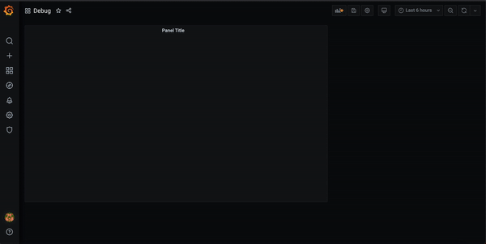

# ImageIt Migration

## Why?

ImageIt was originally a fork of an unmantained plugin. Because of this I wanted to keep compatibility between the two as high as possible, sadly that plugin wasn't developed with best practices in mind.

With the new Grafana sdk I had to rewrite the plugin from scratch and all the old configurations are impossible to read from the new version.
## How?

Click on panel title
Click inspect
Click Panel JSON
Copy everything inside, paste it inside "Input text area"
Copy the result from output text area, paste it inside the panel JSON tab
Click Apply

## Do I really have to do it?

If you want to keep your old data yes. If you are starting a new panel from scratch you are good

## It didn't work!

Open an issue stating what went wrong/is missing.
Attach your panel JSON if you can, replacing every private field with xxxxxxxx
